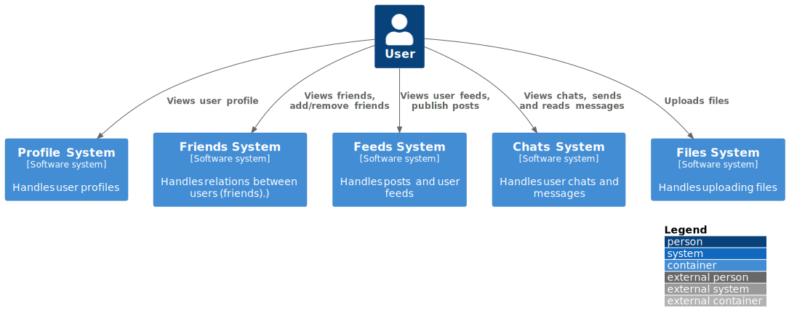
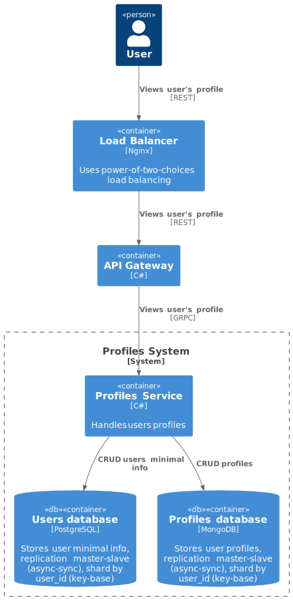
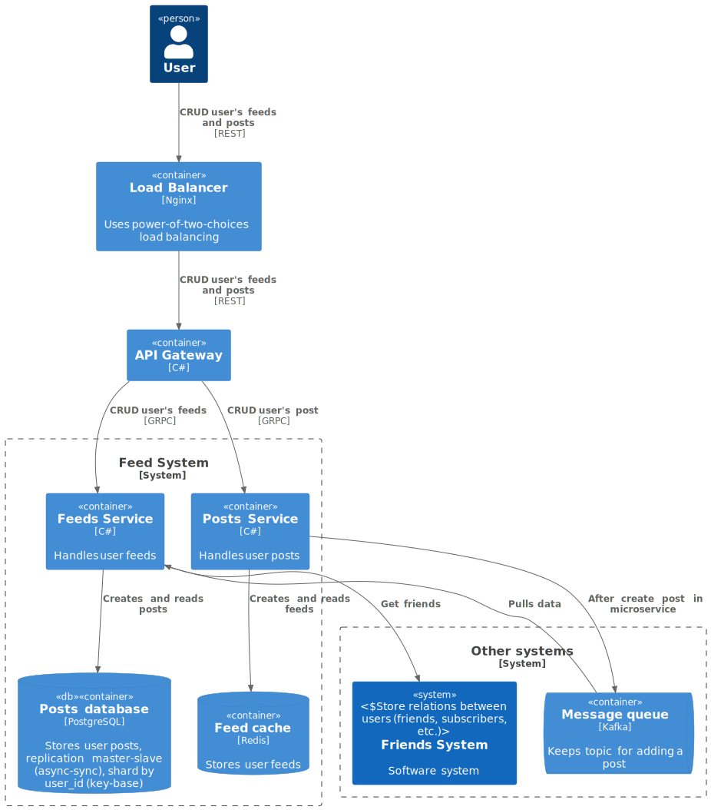
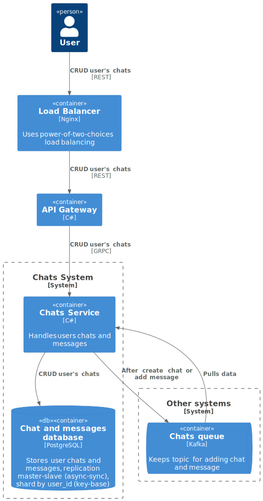

# Social network - System Design

System Design социальной сети для курса по System Design
https://balun.courses/courses/system_design

## Требования

### Функциональные требования

* добавление и удаление друзей;
* просмотр друзей пользователя;
* просмотр анкеты пользователя;
* публикация поста в ленту;
* загрузка медиа файлов для постов;
* просмотр ленты постов (домашней и пользователей);
* просмотр диалогов и чатов пользователя;
* отправка и чтение сообщений в диалогах и чатах;

### Нефункциональные требования

* DAU - 55 000000 (https://inclient.ru/vk-stats/);
* Доступность 99.95%;
* Сервис доступен в СНГ только;
* Срок хранения сообщений и медиа - 5 лет;
* Максимальнео число друзей - 10000;
* Максимальное число пользователей в чате - 100;
* Средняя длина сообщений - 100 символов (utf-8 4 байта);
* Средняя длина поста - 500 символов (utf-8 4 байта);
* Средний размер медиа - 1 Мб;
* Среднее число опубликованных постов в день - 1;
* Среднее число прочитанных постов в день - 20;
* Среднее число отправленных сообщений в день - 5;
* Среднее число прочитанных сообщений в день - 40;
* Среднее соотношение сообщений к сообщениями с медиа - 0.1 (10%);
* Среднее соотношение постов к постам с медиа - 0.8 (80%);
* Время ответа для отправки сообщения - 5 сек;
* Время ответа для получения сообщения - 10 сек;
* В каждом сообщении максимум 1 медиа файл;

## Расчеты системы хранения данных

### RPS

#### Создание постов

$$
\frac{55 \space млн}{(24 \space ч \times 3600 \space с)} = \sim 636 \space rps
$$

#### Чтение постов

$$
\frac{55 \space млн \times 20 \space постов \space в \space день}{(24 \space ч \times 3600 \space с)} = \sim 12731 \space rps
$$

#### Создание сообщений

$$
\frac{55 \space млн \times 5 \space сообщений \space в \space день}{(24 \space ч \times 3600 \space с)} = \sim 3182 \space rps
$$

#### Чтение сообщений

$$
\frac{55 \space млн \times 40 \space сообщений \space в \space день}{(24 \space ч \times 3600 \space с)} = \sim 25463 \space rps
$$

### Траффик

#### Создание постов

$$
{636 \space rps \times 500 \times 4 \space байт} = \sim 1.2 \space МБ/c
$$

#### Чтение постов

$$
{12731 \space rps \times 500 \times 4 \space байт} = \sim 24 \space МБ/c
$$

#### Создание сообщений

$$
{3182 \space rps \times 100 \times 4 \space байт} = \sim 1.2 \space МБ/c
$$

#### Чтение сообщений

$$
{25463 \space rps \times 100 \times 4 \space байт} = \sim 10.2 \space МБ/c
$$

#### Создание файлов

$$
{(636 \space rps \times 0.8 + 3182 \space rps \times 0.1) \times 1} = \sim 827 \space МБ/c
$$

#### Чтение файлов

$$
{(12731 \space rps \times 0.8 + 25463 \space rps \times 0.1) \times 1} = \sim 12731 \space МБ/c
$$

#### Входящий траффик

$$
{1.2 \space МБ/c + 1.2 \space МБ/c + 827 \space МБ/c} = \sim 830 \space МБ/c
$$

#### Исходящий траффик

$$
{24 \space МБ/c + 10.2 \space МБ/c + 12731 \space МБ/c} = \sim 12765 \space МБ/c
$$

### Хранение

### Размер БД для хранения на 5 лет

$$
{830 \space МБ/c \times 36000 \space с \times 24 \space ч \times 365 \space д \times 5 \space лет} = \sim 130 \space ПБ
$$

### Необходимое число дисков (16 ТБ)

$$
\frac{130 \space ПБ \times 1000}{16 \space TB} = \sim 8125 \space дисков
$$

### Необходимое число дисков (16 ТБ) при репликации 2-factor 

$$
\frac{130 \space ПБ \times 1000 \times 3}{16 \space TB} = \sim 24375 \space дисков
$$

## Архитектура

* Использовалась C4 model для дизайна. Показаны уровни C1, C2, поскольку они охватывают общую архитектуру и системы
* Подробнее про C4 model можно найти [здесь](https://c4model.com/)
* Для визуализации использовался [PlantUML ](https://github.com/plantuml-stdlib/C4-PlantUML)
    

* C1 уровень

* С2 уровень
    * Профили: 
      
    * Друзья: 
    * Ленты: 
    * Чаты: 
    * Файлы: 